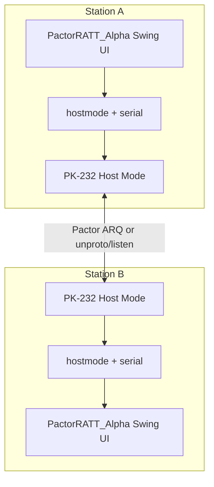
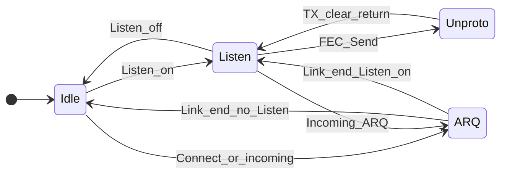
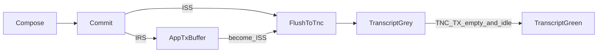

# PactorRATT_Alpha — Software Architecture

In-repo copy of the Cursor architecture plan. Normative product rules also live in [PtRa_specification.md](../PtRa_specification.md).

# PactorRATT_Alpha — Software Architecture (Draft Final)

## 1. Product summary

**PactorRATT_Alpha** is a portable, single-process desktop chat program that links two amateur stations through one **PK-232 with Pactor firmware** using **Host Mode** over a user-selected serial port.

- The TNC owns the ARQ session; this app is a structured Host Mode terminal with a late-90s **AIM 3.x**-inspired UI.
- Display name: **PactorRATT_Alpha** (short form if needed: `PtR_Alpha`).
- **License:** AGPL-3.0 (replace current LICENSE text when implementing).
- **Stack:** Java **21**, **Swing**, **jSerialComm**, **Maven** uberjar.
- **OS:** Windows 10+, macOS, Linux (portable folder next to the jar).
- **Contact for compat popups:** `KJ7RBS@gmail.com`

### Explicit non-goals

File transfer, multi-user, store-and-forward, BBS, Winlink, encryption, network logging, mobile apps, non-PK-232 TNCs, EAS/per-char confirm coloring, Morse-ID disconnect (`CTRL-F`), auto-`AAB`, Spring/DI frameworks, generic TNC abstraction layers.

---

## 2. System context



One active air session per station: **Idle (`Pt` standby)** | **Listen (`PTList`)** | **FEC UI / Unproto (`PTSend`)** | **ARQ (`PTConn`)**.

---

## 3. Process and package layout

One JVM process. Layered packages (no Spring):

| Package | Responsibility |
|---|---|
| `app` | Lifecycle, mode coordinator, window orchestration |
| `ui` | Main / Listen / ARQ windows, dialogs, status bar (EDT only) |
| `hostmode` | Frame codec, command send, event demux, init/compat, outbound drain |
| `serial` | jSerialComm port open/read/write (used only by `hostmode`) |
| `config` | Portable settings, buddies, UI persistence |
| `util` | Debug logging helpers |

**Threading**

- Serial reader thread: bytes → Host frame parser → events.
- `hostmode` may use a small worker for command round-trips / timeouts.
- UI updates only via `SwingUtilities.invokeLater`.
- Never call Swing from the serial thread.

**Build / portable layout**

```text
PactorRATT_Alpha/          (portable folder)
  PactorRATT_Alpha.jar     (Maven shade uberjar)
  config/                  (settings)
  buddies.json
  logs/debug-YYYYMMDD-HHMMSS.log
  docs/                    (optional in release)
```

---

## 4. Application modes and windows



| App mode | TNC posture | UI |
|---|---|---|
| Idle | `Pt` Pactor standby | Main only; inbound ARQ possible; no monitor |
| Listen | `PN` / `PTList` | Listen window created; destroyed on Listen off |
| Unproto (UI label **FEC**) | `PD` / `PTSend` | Same Listen window sending; simplex — no inbound ARQ |
| ARQ | `PG` / `PTConn` linked | One active ARQ window; Listen window idle/disabled |

**Window rules**

- At most **one active ARQ** link; many **dead** ARQ windows until user closes them (Save/copy OK; compose disabled).
- Incoming ARQ while Listen: open ARQ window; stop piping to Listen; disable Listen compose; after link ends, re-enable Listen pipe if Listen still on.
- Close active ARQ or Main while ARQ active → dialog: Abort / Disconnect / Cancel.
- Main close with no ARQ → close other windows and exit.
- New Connect allowed if no active ARQ (dead windows OK).

### Main window (AIM-like)

- Menu: File (Exit), Settings (COM / Program / TNC stub), Help (About).
- Collapsible sections (persist expand state): **Buddies**, **Heard** (` de…`), **Mentioned** (patterns TBD).
- Callsign field + **Connect**; **Listen** toggle; mode label; TNC-connected indicator.

### Connection window (Listen or ARQ)

- Combined **transcript** (colors below).
- **App TX buffer** (IRS hold; not freely editable; right-click Edit).
- **Compose** + **Send**.
- Control buttons (ARQ set below).
- **Status bar:** ISS/IRS, TX on/off, FEC/ARQ/IDLE, link speed, link quality, retries, connected callsign, ticker of last N packet-type reports from TNC (fields stubbed until OPMODE/link docs).

**Transcript colors:** grey = sent to TNC not confirmed; green = confirmed; black = remote / other.

**Link loss:** status + non-modal notice; compose read-only (copy/select-all OK).

---

## 5. Outbound text pipeline



- **Commit mode (Program setting):**
  - **Line:** Enter commits one line → App TX buffer.
  - **Message:** Enter = newline; **Send** commits compose → App TX buffer.
- **IRS:** lines stay in App TX buffer only (not transcript).
- **ISS:** flush entire App TX buffer to TNC (`0x20` data blocks); append to transcript **grey**; further ISS commits append to same open grey block; when TNC TX empty + idle (**discovery deferred**), flip block **green**.
- **EAS:** off for Alpha (no per-char coloring).
- **App TX buffer Edit (IRS queued only):** flush compose→buffer, then buffer→compose.
- Listen **FEC** send: same pipeline via `PTSend`; return to Listen when clear.

Naming: always **App TX buffer** vs **TNC TX buffer**.

---

## 6. Host Mode I/O design

Reference: [`docs/PK232_HostMode_Reference.md`](docs/PK232_HostMode_Reference.md).

- Framing: `SOH CTL payload ETB` with `DLE` escape for `SOH`/`DLE`/`ETB`.
- **Command pacing (Ch. 4 §4.3):** The PK-232 always issues a response to each command; the host **must wait** for that response before issuing another command. Use `sendCommand` (not fire-and-forget) on product/init paths.
- **Data pacing (Ch. 4 §4.4):** After each Host data block (`CTL 0x2x`), wait for data-ack `0x5F … 00` before the next data block. `HostSession` serializes **all** command and data round-trips on one `hostIoLock` so concurrent ISS/ARQ/FEC callers cannot steal acks or clear each other's waiter queues; late responses are discarded on timeout before unlock.
- **`HPOLL OFF`:** continuous serial read; PK-232 pushes blocks; no periodic `GG` flood. Keep `GG` for Host entry probe / recovery only.
- Channel **0** for Pactor.
- **Max Host→TNC block size (Ch. 4 §4.8): 330 payload characters** excluding SOH/CTL/DLE/ETB — enforced by chunking inside `HostSession.sendData`.
- Demux by CTL: data `0x3x`, monitor `0x3F`, echo `0x2F`, link status `0x4x`, link msg `0x5x`, status/error `0x5F`, command rsp `0x4F`.
- **Mnemonics are case-sensitive** (see HostCommands header).

### Suggested `hostmode` types (sketch)

- `HostFrameCodec` — encode/decode blocks
- `HostSession` — port lifecycle, reader loop, send command/data with timeouts
- `PactorController` — mode changes, connect/listen/unproto, control actions
- `CompatChecker` — read `$0006..$0009`, apply fingerprint policy
- `HostEvent` — typed events to `app`/`ui`

---

## 7. Control map (UI → TNC)

| UI action | Host / data action |
|---|---|
| Set callsign | `ML` (`MYCALL`) **and** `Mf` (`MYPTCALL`) from one config value |
| Listen on/off | `PN` / return to `Pt` |
| Connect | `PG` + callsign (`!CALL` allowed manually for long path) |
| FEC send (UI) | `PD` (`PTSend`); end with `<CTRL-D>` (RECEIVE char) |
| Handover | Append `PTOver` char (`PV`, default `<CTRL-Z>`) |
| Handover with text | Canned text → `PTOver` |
| Disconnect after TX clear | Embed `<CTRL-D>` in outbound data |
| Disconnect immediately | **Stub** — no `RC` until manually confirmed |
| Abort | Listen enabled → `PN`; else → `Pt` |
| Seize | `AG` (`ACHG`) while IRS |
| Disconnect with text | Canned text → clean `<CTRL-D>` |
| Clear TNC TX | `TC` (`TCLEAR`) |
| Save chat | Local file dump of transcript |

**Alpha init defaults after Host open + compat:** `EAS OFF`, `PT200 ON`, `PTHUFF OFF`, `WORDOUT OFF`, `HPOLL OFF`, enter `Pt`, set calls, mirror wrap (`AA` / `ACRDisp`) as configured.

---

## 8. Compatibility check

Reference: [`docs/Compat_Memory_Map.md`](docs/Compat_Memory_Map.md).

1. Read four bytes at `$0006..$0009` (date YY MM DD + product).
2. Decode date digits as literal hex→decimal display.
3. `$0009` unused bits = don’t-care; match if **either** bits 7–5 **or** bits 4–0 pattern hits a known class.
4. Policy:

| Result | Behavior |
|---|---|
| Supported fingerprints (v7.0 / 7.0a / 7.1 / 7.2) | Continue; store version label |
| Listed unsupported PK (pre-v7) | **Hard fail** — refuse TNC session |
| Listed unsupported HK-232 (`… 69`) | Warn (needs hardware upgrade) + email `KJ7RBS@gmail.com` + **allow continue** |
| UDC-232 bit pattern | Warn + email + **allow continue** |
| Unknown fingerprint | Warn with 4-byte hex + email + **allow continue** |

GUI remains usable when TNC is disconnected or compat hard-fails (`tncConnected = false`). Prefer disabling Connect when not connected if simple.

---

## 9. Configuration and settings

| Settings submenu | Alpha |
|---|---|
| **COM Port** | Port selector; default **1200 7N1**; speed/bits/parity/stop/flow popup |
| **Program** | Commit mode, listen-on-start, debug log on/off, canned with-text strings |
| **TNC** | Stub / later growth for large param editor; Alpha uses coded init only |

**Debug log:** toggleable; new file each launch; no size limit/rotate; `logs/`.

---

## 10. Explicit stubs / deferred features

Defer implementation details until docs/hardware trials exist:

- OPMODE / status field parsing for status bar
- Link block text for incoming ARQ detect
- TNC TX-empty + idle signal for grey→green
- `Rcve` (`RC`) = disconnect-now?
- Monitor regex samples beyond ` de` for Heard; Mentioned patterns
- Full Settings→TNC parameter push UI

Skeleton may show placeholder status values and leave grey text grey until confirmation logic exists.

---

## 11. Implementation phases (when you ask to build)

1. **Maven skeleton** — Java 21, packages, shade jar, jSerialComm, AGPL LICENSE.
2. **UI shell offline** — Main + connection window layouts, commit modes, buffers, menus; `tncConnected` gate.
3. **Serial + Host framer** — enter Host, `HPOLL OFF`, reader loop, debug hex log.
4. **Compat + init** — fingerprint policy, callsign set, `Pt`, defaults.
5. **Pactor flows** — Listen / Connect / Unproto-FEC / control buttons that are not deferred.
6. **Status + confirm** — fill stubs as OPMODE/TX-empty/incoming-ARQ become known.

---

## 12. Success criteria (Alpha)

- Portable uberjar runs on Win10+ / macOS / Linux with Java 21 without a TNC (UI exercisable).
- With supported PK-232: open COM, pass compat, init, set callsign, Listen and/or ARQ connect.
- Line/Message commit; IRS hold in App TX buffer; ISS flush → grey transcript (green when confirmation known).
- Control actions per map (except deferred disconnect-now / Morse ID / AAB).
- Save chat; toggleable raw Host debug log.
- No non-goal features implemented.

---

## 13. Reference docs

- [`docs/PK232_HostMode_Reference.md`](docs/PK232_HostMode_Reference.md)
- [`docs/HostCommands - Trimmed.md`](docs/HostCommands%20-%20Trimmed.md)
- [`docs/Pactor_Chapter.md`](docs/Pactor_Chapter.md)
- [`docs/Compat_Memory_Map.md`](docs/Compat_Memory_Map.md)

