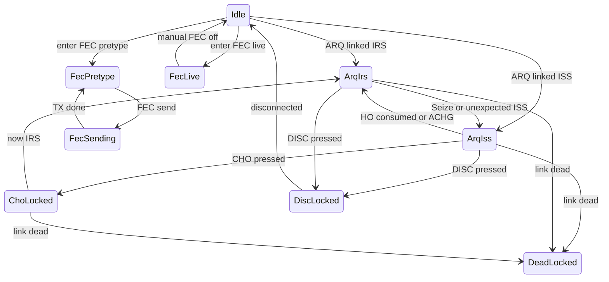

# Text input specification

Working design note for **Compose**, **transcript**, and every keystroke that can become Host channel-0 data. This file owns text-input behavior until it is merged into `PtRa_specification.md`. Implementation is out of scope here.

**Edit this file only** for this discussion. Java and other docs are read-only reference.

Decided in the design discussion:

- FEC has two modes: **pretype** and **live**.
- Seize and unexpected ISS (other station HO) use the **same dump rules**.
- CHO or Disc **button press** locks Compose immediately. Stay locked through disconnect. After CHO, unlock when local role is IRS.

Not decided (options + tradeoffs, decision boxes at the end):

- ARQ IRS edit model.
- ARQ ISS already-sent text on the current line (`$08` vs lock).
- Whether FEC and ARQ share one compose system (recommendation below; reject it if you want).

---

## 1. Purpose and scope

### 1.1 What this file specifies

- Compose editing rules per mode (FEC pretype, FEC live, ARQ IRS, ARQ ISS).
- When typed text is handed to the TNC vs held locally.
- Newline / Enter, Backspace / `$08`, paste, cursor, selection.
- CHO / Disc **Compose lock** (input freeze) vs HO **button lock** (controls).
- Transcript paint of local outbound (grey) vs remote inbound (black), including inbound `$08`.
- Shared vs separate machinery: recommendation and alternatives.

### 1.2 What this file does not specify

- Host framing, OPMODE decode, connect/listen/call, canned-string *contents*, FEC baud/retries, EAS, grey→green confirm coloring.
- Wire bytes for HO (`$1A` / CTRL-Z) and Disc (`$04` / CTRL-D), except where they interact with Compose lock and leftover text.

### 1.3 Today’s code (read-only map)

| Piece | Where | What it does now |
|---|---|---|
| ARQ Compose | `ConnectionWindow.java` | App TX + Compose + Send + **Flush ISS**. `commitComposeLines` / `enqueueOrFlush`: IRS → App TX; ISS → grey transcript + `sendOutboundChat`. OPMODE IRS→ISS calls `flushIss()`. |
| IRS→ISS dump | `flushIss()` / `drainAppTxBufferToTranscript()` | Drain App TX to Host + grey; empty buffer still marks ISS. Same drain for Disc/HO after TX clear (then control byte). |
| ISS→IRS | `applyOpmodeLink` | `localIsIrs = true`; further commits hold in App TX. |
| FEC | Listen window | App TX + Send + **FEC / End TX**. Line/Message commit shared with ARQ. CQ uses canned text × repeat on the same `PD` + data + CTRL-D path; does not touch App TX. |
| Host send | `AppController.sendOutboundChat` / `listenFecEndTx` | Ch0 data, 330-char chunks, wait `$5F` ack. `toHostDataBytes(text)` always appends trailing CR. |
| HO / Disc | `AppController` | After TX clear: drain App TX then control byte. “Now”: `TC` then control byte, **do not** flush App TX. HO buttons lock until ISS again (`handoverLocked`). |
| Dead ARQ | `setSessionActive(false)` | Compose not editable; Send disabled (still selectable/copyable). |
| Inbound `$08` | `applyInboundTranscript` | Deletes one char on the current **remote** transcript line; will not cross `\n` or delete local grey. Extra BS consumed. |

`PtRa_specification.md` §7–8 and `project_brief.md` describe App TX / Send / Flush ISS. This file is a design discussion for possible later live-send work. Where this file disagrees with those docs, the Java + spec are current.

UI labels: **HO** = handover / CHO. Wire is ch0 `$1A`, not Host `PV`. **Seize** = Host `AG` (ACHG).

---

## 2. Hard constraints (not options)

These are forced by the PK-232 / Pactor / Host Mode. Compose design must obey them.

1. **Only the information-sending side may put chat bytes on Host ch0.** ARQ IRS queues locally. FEC TX is the unproto equivalent (simplex; no inbound ARQ during TX).
2. **Losing ISS immediately stops outbound, including `$08`.** Triggers: local HO, remote ACHG/HO, disc, abort, dead link. Unsent local text does not go out until we are ISS again.
3. **Seize and unexpected ISS dump the same way.** No special “half-written draft” path when the other station hands over.
4. **The app can only track “handed to TNC,” not “already on their screen.”** ARQ retries, TNC TX buffer, and ACHG timing sit below Host. `sentOnCurrentLine` is a Host-handoff floor, not an RF ACK.
5. **Newline on the wire is CR (`\r`).** UI may use `\n`; `toHostDataBytes` normalizes. Live fragments and `$08` must pass `ensureTrailingCr = false`.
6. **Host→TNC payload max is 330 characters** per data block (`HostFrameCodec.MAX_HOST_TO_TNC_PAYLOAD`). FEC pretype dumps, IRS→ISS dumps, and with-text HO/Disc must chunk and wait for data-ack.
7. **One Host I/O at a time** (`hostIoLock`). ISS fragments serialize on `issOutboundExecutor`.
8. **Control bytes travel as ch0 data**, never by firing Host `RE` / `PV`. Disc = `$04`. HO = `$1A`.
9. **EAS is OFF.** No per-char echo coloring. Local outbound stays grey.
10. **Backspace never walks onto a previous RF line.** `$08` is current-line only, inbound and outbound.

### 2.1 “Handed to TNC” vs remote screen

If we were ISS, sent `hellbo`, then lost ISS:

- Those bytes may already be on their transcript, still in *our* TNC TX buffer, or in flight.
- After we are IRS we cannot send `$08` to repair them.
- When we become ISS again, `$08` would apply to **our new outbound stream**, not magically unprint their copy of the previous burst.
- Therefore: on ISS loss, freeze the sent floor; do not queue `$08` for later. Repair of already-handed text is possible only while we still know we are ISS (and only if the chosen ISS option allows `$08` at all).

---

## 3. Shared vs separate machinery

### 3.1 Recommendation: one Compose widget, two engines, one lock overlay

FEC and ARQ should **not** be two unrelated editors. They should also **not** be one giant `switch (mode)` with copied caret/paste/`$08` code. Share the widget and two engines; keep ARQ-only policy as flags.

| Engine | What it is | FEC | ARQ |
|---|---|---|---|
| **FreeBuffer** | Multiline, freely editable, **no** Host I/O until an explicit commit | Pretype (commit = FEC send) | IRS, *if* a full-edit IRS model is chosen |
| **LiveLine** | Current line only. Send policy and `$08` policy are flags | Live: send every char immediately; `$08` on Backspace | ISS: 1 Hz coalescing of unsent suffix; `$08` per ISS option |
| **TransmitLock** | Overlay: Compose not editable (still selectable/copyable) | Pretype in flight; dead Listen | CHO press → wait IRS; Disc press → stay locked; dead link |

Why this split:

- FEC pretype and “IRS as a draft” are the same UX class (edit freely, nothing live).
- FEC live and ARQ ISS are the same UX class (current line, chars leave, `$08` may leave). The differences are **policy flags**, not a different widget: per-char vs 1 Hz; no role vs ISS/IRS; no ACHG vs must freeze on role loss.
- TransmitLock is the CHO/Disc/FEC-sending freeze. It is not a third editor.

Naive share that **will** break: treating FEC live like ARQ ISS without a sent-floor/role flag. FEC has no ACHG, so a 1 Hz timer is unnecessary and a sent-floor-vs-ACHG path must not run. Conversely, sending ARQ ISS every keystroke (FEC-live policy) would spam Host I/O against a ~1 s ARQ cycle.

### 3.2 Alternatives

**A. Fully separate FEC vs ARQ code.** Similar UX where it happens to match, duplicated paste/caret/`$08`/lock. Safest if the IRS model stays “lock on newline” and FEC live is a thin Listen add-on. Cost: two bugs for every edit-rule change.

**B. One widget, giant mode table** (Idle / FEC-pretype / FEC-sending / FEC-live / ARQ-IRS / ARQ-ISS / CHO-lock / DISC-lock / dead). Shared UI, forked rules in one class. Matches today’s `ConnectionWindow` shape. Gets unreadable if IRS full-edit and ISS `$08` flags pile on.

**C. Two panes always** (draft + live line). Maps cleanly to FreeBuffer + LiveLine as *visible* panes. Extra UI; users will type in the wrong one. Only justified if IRS option D (two-pane) is chosen.

### 3.3 What must stay ARQ-only even if engines are shared

- Role (ISS/IRS) from OPMODE `*x*`.
- 1 Hz clock and `sentOnCurrentLine`.
- `pendingLineCr` after ISS→IRS mid-line.
- CHO Compose lock until IRS; HO **button** lock until ISS again (different lock).
- Seize (`AG`) as a dump trigger (same dump as unexpected ISS).

FEC-only: `PD` + data + `$04`; no ISS/IRS; CQ path that bypasses Compose.

**Decision:** recommendation is §3.1. Reject it in the open-decisions list if you want A or B.

---

## 4. Compose state machine

TransmitLock is active in `FecSending`, `ChoLocked`, `DiscLocked`, and `DeadLocked`.

Idle here means “not in a sending posture”: Listen with empty/unlocked pretype Compose, or no ARQ. Dead ARQ windows stay `DeadLocked` until closed.

---

## 5. Transcript (shared)

- Combined sent + received scrollback for the life of the window.
- **Black** (`REMOTE_TEXT`): remote inbound.
- **Grey** (`LOCAL_PENDING`): local completed outbound. Stays grey. No confirm recolor.
- Select All / Copy. Save chat dumps transcript text.
- Inbound `$08`: delete one character on the current remote line; do not cross `\n`; do not delete local grey; extra BS consumed.
- Before painting a new local line, if the transcript does not already end with `\n`, insert a newline so local grey does not continue a remote line (`ensureTranscriptNewline`). No leading blank line on an empty transcript.
- Completed local lines leave Compose (or App TX) and do not return.

---

## 6. FEC pretype

Target UX: compose the whole message, press FEC send, Compose locks, message is chunked and sent, then Compose unlocks.

### 6.1 While editing

- Compose is a **FreeBuffer**: fully editable. Newlines, caret in the middle, select, delete, paste, undo-if-we-have-it.
- Nothing is sent to the TNC.
- Enter inserts a newline (does not send).
- Empty Compose: FEC send is a no-op with a notice (today: App TX empty).

### 6.2 On FEC send

1. If Compose (or today’s App TX) is blank → notice, stay in pretype.
2. Enter **TransmitLock** (not editable).
3. Paint the payload grey on the transcript (ensure trailing newline for display).
4. Host: `PD{n},{x}` then ch0 data (330-char chunks) then `$04`.
5. Hold lock until FEC TX ends (OPMODE leaves `PD` Traffic / returns to Listen posture).
6. Unlock back to pretype.

### 6.3 Open: clear vs keep after send

| Option | After TX done | Why |
|---|---|---|
| **Clear** (today’s App TX) | Compose empty, unlocked | Matches “that message is gone.” No accidental re-send. |
| **Keep locked-visible, then unlock** | Text still there, selectable; user deletes or edits for a repeat | Handy for CQ-like repeats; easy to double-send. |
| **Keep but require explicit re-send** | Same as keep; FEC send of unchanged text allowed | User must press FEC again; still a double-send risk. |

CQ stays a **separate path**: Program canned CQ × repeat, same `PD` + data + `$04`, does **not** read or clear Compose / App TX.

### 6.4 Relation to today’s App TX + Send

Today is a two-step pretype: Compose → **Send** → App TX (not freely editable; right-click Edit merges back) → **FEC / End TX**. The target pretype is one buffer: Compose *is* the message; FEC send commits it. App TX + Send can go away on Listen if this spec is implemented as written. Right-click Edit becomes unnecessary.

Until that lands, treat App TX as the pretype commit buffer.

---

## 7. FEC live

Target UX: enter FEC live, FEC TX is on, each keystroke goes to the modem, Backspace sends `$08`, only the current line is editable, Enter pushes that line to the transcript. Manual FEC off.

### 7.1 Entering and leaving

- Enter live: start unproto (`PD`) and switch Compose to **LiveLine**.
- Manual FEC off: send `$04` (end TX), stop sending keystrokes, return to Idle / pretype (pick one in implementation; default: **pretype**, empty current line, leftover current line either dropped or moved into FreeBuffer — see open decisions if leftover matters).
- No 1 Hz timer. Send every printable character as it is typed.
- No ISS/IRS. No ACHG. No CHO. Disc/Abort of a Listen window is not an ARQ role change.

### 7.2 Current line

- Cursor locked to end (same LiveLine default as ARQ ISS).
- Type appends and sends that character immediately (`ensureTrailingCr = false`).
- Backspace: if the current line is non-empty, delete last char locally and send `$08`. Stop at start of line. Never `$08` across a previous transcript line.
- Enter: send CR now if the line has unsent remainder (in live, remainder should already be sent, so Enter is CR only); move the line to grey transcript; clear Compose; start a fresh line.
- Empty Enter: blank CR (blank RF line).
- Cannot edit previous lines. They are already in the transcript.

### 7.3 FEC-off vs last keystroke race

FEC has no ACHG, but FEC off can race a key. **Rule:** once FEC off is pressed, TransmitLock (or immediate engine switch) drops further keystrokes. Do not queue-one. A character already given to `sendData` is allowed to finish.

### 7.4 Contrast with ARQ ISS

| | FEC live | ARQ ISS |
|---|---|---|
| Tempo | Every character | 1 Hz unsent suffix |
| `$08` | Always, current line | Per ISS option |
| Role loss | FEC off only | ACHG / HO / disc |
| Dump of a buffer | None | IRS→ISS dump |
| Idle fill | TNC FEC idle while TX is up | ARQ idle frames if we send nothing |

---

## 8. ARQ IRS

Majority of the design. While IRS, **nothing** is sent to the TNC. Compose is a local draft until we become ISS (Seize or unexpected ISS — **same dump**).

Today (Build 33): Enter commits the current line into `lockedLines` (read-only, grey, above Compose). Current line stays editable. Cannot backspace past a newline. This is option A.

### 8.1 What “current line” means on dump

When becoming ISS, the dump needs a definition of **current line** vs **committed lines**:

| Definition | Meaning | Risk |
|---|---|---|
| **Last line of the buffer** | Everything before the final `\n` is committed; text after the last `\n` is the live line (no CR on dump) | Cursor may not be on that line if full-edit is allowed |
| **Line containing the caret** | Split the buffer at the caret’s line | Surprising if the caret was moved to review an earlier paragraph |
| **Entire buffer is committed** | Dump all with CR on every line (including a final CR on the last fragment), then a fresh empty LiveLine | Cannot continue a half-typed last sentence live |

Options A and (typically) B use **last line**. Option C uses **entire buffer**. Option D uses the live-line pane only.

### 8.2 Option A — Lock on newline (today)

Enter while IRS appends the current line plus `\n` to a read-only region above Compose and clears the current line. Cannot backspace into locked lines. Become ISS: send locked lines (with their CRs) + unsent current (no CR). Locked lines → grey transcript. Current line stays in LiveLine with sent-point = length.

**Pros**

- Same mental model as ISS (current line = the live one).
- Impossible to edit a line you already “committed.”
- Simple state: `lockedLines` + one current string + `sentOnCurrentLine`.
- Already implemented.
- Paste of N lines = N Enters + leftover; well-defined.

**Cons**

- Cannot fix a typo two lines up in a queued reply.
- Feels like ISS constraints while *not* on air.
- Accidental Enter permanently parks a line until ISS dump (or after-TX-clear flush).

### 8.3 Option B — Full edit until ISS, then lock to current line

While IRS, Compose is a **FreeBuffer**: edit anywhere, insert/delete newlines, select, caret not glued to end. On become ISS: treat **last line** as current (no CR); everything before the last `\n` dumps with CRs, goes to transcript, and disappears from Compose. Then switch to LiveLine on the remaining last line.

**Pros**

- Natural drafting while the other station talks.
- Can restructure the whole reply.
- Matches “IRS = buffer, ISS = live line.”
- Shares FreeBuffer with FEC pretype.

**Cons**

- Dump of a messy draft on unexpected ISS (accepted: same dump as Seize).
- Need a visible cue that “after last newline is the live line” before ISS, or users will be surprised which fragment stays.
- Mid-dump: if they were editing paragraph 1 with the caret, last-line definition ignores the caret (document this so it is not a bug).
- Harder caret/selection code; LiveLine guards must install only on ISS / FEC live.

### 8.4 Option C — Full edit, dump entire buffer, fresh current line

Same IRS FreeBuffer as B. On become ISS: dump **all** text as RF lines (every newline = CR; last fragment gets CR too), move all of it to grey transcript, start a **fresh empty** LiveLine.

**Pros**

- Simplest ISS transition: buffer = what will be sent, then empty.
- No “half line stays live.”
- No sent-point inherited from a draft fragment.

**Cons**

- A half-typed last sentence is committed with CR the instant you get ISS (including unexpected HO).
- Cannot continue that sentence on the 1 Hz clock.
- Worse than B for “I was still writing when they handed over.”

### 8.5 Option D — Two panes while IRS

Free-draft pane (never auto-sent) + a current-line pane that becomes LiveLine on ISS. Dump sends only the current-line pane (+ any explicit “send draft” action if we add one). Draft stays local until the user moves it.

**Pros**

- Explicit: notes vs “this will go.”
- No surprise dump of the draft on unexpected ISS.
- Maps 1:1 to FreeBuffer + LiveLine as visible UI.
- FEC pretype could reuse the draft pane.

**Cons**

- Two places to type. “Why isn’t this sending?”
- Extra UI vs AIM-like single Compose.
- Users must remember to copy draft → send line.
- Breaks “same dump for Seize and unexpected ISS” unless dump is defined as “send-line only” (draft never dumps). That is a third dump meaning.

### 8.6 Option E — Something else

If none of A–D fit, add it here rather than silently mixing rules (e.g. full edit but Enter still “commits” a visual breakpoint without locking).

### 8.7 IRS Backspace / Enter (independent of A–D where possible)

- **No Host send** while IRS.
- Enter: option A locks a line; B/C insert `\n` in the buffer; D applies Enter to the focused pane.
- Backspace: never sends `$08` while IRS. Option A stops at start of current line (and at `sentOnCurrentLine` if a leftover sent prefix exists after ISS→IRS). B/C may delete across newlines. D: draft pane free; send-line pane like A.
- `pendingLineCr`: if we were ISS, had handed text on the current line, then became IRS, then the user hits Enter on that remnant — do not re-send the remnant; send CR first on next ISS. This stays valid under A and B (last line with a sent floor). Under C the remnant would already have been dumped on the *previous* become-ISS, so this path is rarer.

### 8.8 IRS → ISS dump (same for Seize and unexpected ISS)

Shared sequence once an option is picked:

1. Stop treating Compose as IRS-editable; switch to LiveLine (or empty LiveLine for C).
2. Build Host payload from the option’s dump rules. Chunk at 330. `ensureTrailingCr = false` for the unterminated current fragment (A/B). C terminates everything.
3. Paint dumped committed lines grey. Current live fragment stays in Compose with sent-point = its length (A/B) or empty (C).
4. Start the 1 Hz clock.
5. If payload is empty, still start the clock so new typing goes out within ~1 s.

---

## 9. ARQ ISS

Keep the **1 Hz tempo**: a clock sends the **unsent suffix** of the current line with no extra CR. That matches the Pactor ARQ cycle and avoids long idle stretches without spamming Host.

### 9.1 Baseline LiveLine (all ISS options)

- Cursor locked to **end**. Type or Backspace only. No click-to-insert, no select-delete, no Ctrl+Backspace, no arrow/Home/End/Delete (consumed; caret snapped to end). This is today’s ISS behavior and the LiveLine default. IRS full-edit (B/C) **relaxes** this only while IRS.
- **1 Hz clock** (`1000 ms`) sends `unsentSuffix` if non-empty, then sets sent-point to line length.
- **First tick delay:** today the clock *restarts* on become-ISS / Enter, so the first characters wait up to 1 s. Keep unless we later add “send immediately on first char, then 1 Hz.” Call that out if it feels laggy on air.
- **Enter:** send unsent remainder + CR **now**; move the full current line to grey transcript; clear Compose; reset sent-point; restart the 1 Hz clock. Empty Enter = blank CR.
- **Paste:** each complete line is processed as Enter; leftover fragment stays on the current line (and will go out on the next tick or sooner if we send-on-first-char).
- Dead link / Disc lock / CHO lock: stop the timer; no further Host send from keystrokes.

### 9.2 Already-sent text on the current line

The other station can ACHG and take ISS without a local button press. Characters already handed to the TNC must not be treated as still fully editable. Four options:

#### ISS-1 — Per-character sent floor + `$08` (today)

Unsent suffix is editable (append only, caret at end). Backspace into the sent prefix deletes locally, decrements the floor, and sends `$08`. Backspace stops at start of current line. On ACHG: freeze send; remaining unsent suffix stays local for the IRS model; do **not** send `$08` after IRS.

Example: type `hellbo`, tick sends `hellbo`, BS BS, type `o` → air `hellbo $08 $08 o` → remote `hello` **if we stayed ISS**.

**Pros**

- Only way to fix a typo after the 1 Hz tick without looking broken on their screen *while still ISS*.
- Familiar from hardware terminals / Build 33.
- Unsent suffix is still cheap to edit (not yet on Host).

**Cons**

- After ACHG, local line and remote line can diverge; `$08` cannot repair their copy.
- Caret-at-end + `$08` is a typewriter, not a text box.
- Users may BS into sent text after they already lost ISS if the UI does not freeze fast enough (must freeze on OPMODE IRS **before** handling the next key).

#### ISS-2 — Lock the whole current line once any of it has been sent

After the first 1 Hz tick (or first character handed over), the entire current line is frozen. Further typing goes to a new line, or typing is blocked until Enter (Enter would send CR and clear). No `$08`.

**Pros**

- No `$08` protocol surprises. No floor bookkeeping.
- ACHG cannot leave a half-repairable line; the line is already “committed” locally.

**Cons**

- 1 Hz tick (or first char) makes the line untouchable. Typos wait until the next line, so the remote sees the typo forever.
- Idle-avoiding 1 Hz fights usability: the clock that keeps the link busy also steals the line from the user.
- Unclear where new typing goes if we do not auto-open a next line.

#### ISS-3 — Lock sent prefix visually; unsent suffix editable; no `$08`

Show sent prefix as locked (read-only styling). User may only edit the unsent tail (still caret-at-end). Backspace stops at the sent floor and does **not** send `$08`. ACHG locks the prefix; leftover unsent stays local.

**Pros**

- Honest UI: “this part already left.”
- No `$08` over the air, so no repair-after-ACHG confusion.
- Unsent tail still fixable before the next tick.

**Cons**

- Typos that already ticked out cannot be fixed. Same remote-typo problem as ISS-2, but only for the prefix.
- Need a visual split on one line (grey prefix / black-or-normal suffix) inside Compose, not only transcript.
- Slightly more UI work than ISS-1 without gaining repair.

#### ISS-4 — `$08` only while we still know we are ISS; freeze prefix on ACHG

While OPMODE says ISS: behave like ISS-1. On transition to IRS: convert the sent prefix into a locked remainder (like ISS-3 or like option A’s `sentOnCurrentLine` floor with no `$08`). Unsent suffix stays editable under the IRS model. No `$08` after IRS, even if the user BSes the old prefix.

**Pros**

- Best of ISS-1 during a stable ISS period.
- Makes the ACHG rule explicit in the option instead of only in “hard constraints.”
- Matches what Build 33 *should* do if OPMODE IRS arrives before the next Backspace.

**Cons**

- Two behaviors on one line depending on role; must be visible (status ISS/IRS is not enough if the line still looks editable).
- Same post-ACHG divergence as ISS-1 for text already on their screen.
- Implementation must apply role change on the EDT **before** the next key handler.

### 9.3 ACHG / HO while mid-line

1. Stop the 1 Hz timer. Drop or ignore in-flight keystrokes after TransmitLock / IRS.
2. Do not send `$08` or unsent suffix.
3. Keep unsent suffix in Compose. Keep sent prefix as local knowledge of the floor (ISS-1/4) or as locked text (ISS-2/3).
4. Apply the **IRS** option to whatever is left (A: current line stays; locked lines unchanged. B/C: buffer stays editable. D: send-line vs draft unchanged).
5. Next become-ISS uses the **same dump** as Seize.

Do not try to `$08` text that left while we were ISS after we are IRS.

### 9.4 CHO / Disc vs ACHG

User-pressed CHO/Disc also stop ISS send, but they add **TransmitLock** immediately (next section). Remote ACHG does **not** lock Compose; it switches to IRS editing so the user can draft a reply while the other station talks. That is the point of unlocking after CHO once we are IRS: they can see they are in a buffer again.

---

## 10. CHO / Disc Compose lock

### 10.1 Intent

If the user presses CHO or Disc, they are no longer in a “keep typing, it still goes out” situation. If Compose stays live, they can be mid-sentence when the link flips and the rest of the sentence follows different rules. **Lock Compose on button press.**

| Event | Compose | Controls |
|---|---|---|
| CHO pressed | TransmitLock immediately | HO **buttons** also lock (today: until ISS again). Different lock. |
| CHO completed, local role IRS | Unlock Compose; apply IRS edit model | HO buttons stay locked until a later ISS (existing `handoverLocked`) |
| Disc pressed | TransmitLock immediately | Stay locked |
| `$50 DISCONNECTED` / abort / dead | TransmitLock (`DeadLocked`) | Session inactive |
| Remote ACHG (no local button) | Do **not** TransmitLock; switch to IRS editing | HO buttons unchanged unless already locked |

Stay locked through disc (do not re-enable on a brief IRS blip during teardown).

### 10.2 Input lock vs leftover text

Lock is about **input**, not about whether already-typed unsent is flushed.

Existing Host paths stay:

| Button | Compose leftover | Control byte |
|---|---|---|
| Disc. after TX clear | Drain (locked lines + current; CR if current not empty) then `$04` in the same block | `$04` |
| Disconnect now | **Do not** flush Compose; `TC` then `$04` | `$04` |
| HO after TX clear | Drain then `$1A` in the same block | `$1A` |
| Clear TX and Handover | **Do not** flush; `TC` then `$1A` | `$1A` |
| HO / Disc with text | Canned string + control byte; **does not** read Compose | `$1A` / `$04` |

On “now” buttons, leftover Compose text remains visible but **not editable** until IRS (CHO) or forever (Disc/dead). That leftover is then subject to the IRS model if CHO landed IRS, or discarded with the dead window if Disc.

**Open:** on CHO press, should we also **visually** mark Compose as “not sending” (watermark, dim, status) in addition to `setEditable(false)`? Recommendation: yes — disable plus a status/notice (“HO sent — Compose locked until IRS”).

### 10.3 HO button lock vs Compose lock

Do not conflate:

- **HO button lock** (`handoverLocked`): disable HO / HO after TX clear / HO with text until OPMODE shows IRS *after* we have been ISS since the lock, then ISS again. If already IRS at press, that IRS does not count. With OPPOLL=0, poll `OP` at 2 Hz while locked.
- **Compose TransmitLock:** disable typing on CHO/Disc press; re-enable on IRS after CHO; stay off on Disc.

A user can be IRS with Compose **unlocked** (drafting) while HO buttons are still locked (waiting to be ISS before HO is allowed again). That is correct.

### 10.4 Seize

Seize is Host `AG`. It does not TransmitLock Compose. It requests ISS; when OPMODE shows ISS, run the same dump as unexpected ISS. Compose stays editable under ISS LiveLine rules.

---

## 11. Cross-cutting

### 11.1 Paste

- **LiveLine** (FEC live, ARQ ISS): normalize `\r\n` / `\r` to `\n`. Each complete line = Enter. Leftover fragment stays on the current line.
- **FreeBuffer** (FEC pretype, ARQ IRS B/C): paste as normal multiline text. No Host send.
- **IRS option A:** paste uses the LiveLine-like Enter rule (complete lines lock above).
- Ignore paste while TransmitLock.

### 11.2 Selection, navigation, Delete

| Engine | Allowed |
|---|---|
| FreeBuffer | Normal: arrows, Home/End, click, select, Delete, Backspace (local only). |
| LiveLine | Append at end, Backspace at end only. Consume nav / Delete / select-delete / Ctrl+Backspace. Snap caret to end. |
| TransmitLock | Not editable; selection and copy still allowed (same as dead ARQ today). |

### 11.3 Canned text vs Compose

- **CQ:** canned × repeat; FEC path; does not use Compose.
- **HO with text / Disc with text:** canned + control byte; does not use Compose. Still apply Compose TransmitLock on those buttons if they are CHO/Disc class (they are).
- Program settings store the strings; Compose does not edit them.

### 11.4 Listen vs ARQ windows

- Listen window: FEC pretype and FEC live. No ISS/IRS. Compose disabled while an **active** ARQ window exists; re-enabled when back in Listen (`PtRa_specification.md` §7.3).
- ARQ window: IRS/ISS/CHO/Disc. No FEC send on that window.
- Closing an active ARQ window still needs Abort / Disconnect / Cancel. Disconnect should use a real Disc path (today the close-dialog Disconnect is still a stub). Compose lock on that Disconnect should match Disc press.

### 11.5 Dead link

Stop 1 Hz timer. TransmitLock. Do not flush leftover to Host. Transcript remains. Compose readable.

### 11.6 Character set

Host data is the TNC’s 8-bit payload. This spec does not add Unicode policy. What the user can type is whatever Compose accepts today; outbound goes through `toHostDataBytes`. `$08` is a data byte, not a GUI “delete selection.”

---

## 12. Engine × mode matrix

| Mode | Engine | Host send | Enter | Backspace | Lock |
|---|---|---|---|---|---|
| FEC pretype edit | FreeBuffer | None | Newline | Local | Unlocked |
| FEC pretype sending | (frozen buffer) | Chunked `PD` payload | Ignored | Ignored | TransmitLock until TX done |
| FEC live | LiveLine, per-char | Each char; CR on Enter | Line → transcript | `$08` | Unlocked until FEC off |
| ARQ IRS A | Locked lines + current | None | Lock line above | Local, stop at line start | Unlocked |
| ARQ IRS B | FreeBuffer | None | Newline in buffer | Local, may cross lines | Unlocked |
| ARQ IRS C | FreeBuffer | None | Newline in buffer | Local, may cross lines | Unlocked |
| ARQ IRS D | Draft FreeBuffer + send LiveLine | None | Per focused pane | Per focused pane | Unlocked |
| ARQ ISS | LiveLine, 1 Hz | Unsent suffix; CR on Enter | Line → transcript | Per ISS-1..4 | Unlocked unless CHO/Disc |
| CHO pressed | Frozen | Drain only if “after TX clear” | Ignored | Ignored | Until IRS |
| Disc pressed | Frozen | Drain only if “after TX clear” | Ignored | Ignored | Until idle/dead |
| Dead | Frozen | None | Ignored | Ignored | Until window closed |

---

## 13. Open decisions

Check these off in this file when decided. Do not implement until they are checked.

- [ ] **Share vs separate.** Default recommendation: §3.1 (one widget, FreeBuffer + LiveLine + TransmitLock). Alternative A or B if rejected.
- [ ] **ARQ IRS model.** A lock-on-newline (today) / B full-edit then last line live / C full-edit then dump all / D two-pane / E other: ________
- [ ] **Current-line definition on dump** (if B): last line of buffer (recommended) vs caret line.
- [ ] **ARQ ISS sent text.** ISS-1 `$08` floor (today) / ISS-2 lock whole line / ISS-3 lock prefix no `$08` / ISS-4 `$08` only while ISS then freeze.
- [ ] **FEC pretype after send.** Clear Compose (recommended, matches today) vs keep text.
- [ ] **FEC live leftover on FEC off.** Drop current line vs move into pretype FreeBuffer.
- [ ] **ISS first-char delay.** Keep “wait up to 1 s” vs send immediately on first char then 1 Hz.
- [ ] **CHO lock visual.** `setEditable(false)` only vs also notice/dim/watermark (recommended: notice + not editable).
- [ ] **Listen UI.** Keep App TX + Send as the pretype commit step vs Compose-is-the-buffer (recommended target).

---

## 14. Suggested pick (non-binding)

Not decided. If a default is needed to keep engines coherent:

- Share §3.1.
- IRS **B** (full edit, last line becomes live) — IRS should feel like a draft, ISS like FEC live. Unexpected ISS dumping a messy draft is accepted.
- ISS **4** ( `$08` while ISS, freeze on role loss) — keeps typo repair during a stable send, and matches the hard constraint on ACHG.
- FEC pretype **clear** after send.
- FEC live leftover → pretype FreeBuffer (do not silently drop).
- First char **immediate**, then 1 Hz (reduces the “I typed and nothing happened” beat without returning to per-char Host spam).

Strike this section if you do not want a lean-in.
